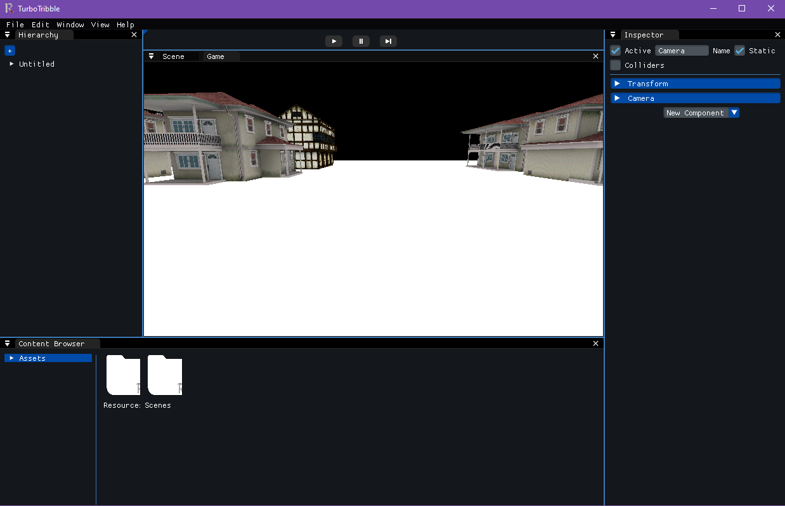

# TurboTribble

TurboTribble is a game engine that we've developed as a project of the Motors de Videojocs subject in [CITM](https://www.citm.upc.edu/) a UPC University center. In this software you can create your dream videogames with an object system developing.

## Team

[**Òscar Canales**](https://github.com/Osvak)

[**Carles Garriga**](https://github.com/FireAlfa)

## Main Core Sub-Systems

- Camera system
- Model and texture loader (with drag and drop)
- GameObject systems with components
- Custom File Format
- Serialization of the scene
- Mouse picking for selecting GameObjects
- Frustum Culling
- Resource manager system for displaying the files
- Time management for Game Mode
- Guizmos for better user experience
- Multiple viewports

## User Interface Sub-System

With this Sub-system 

## User Interface Demo 

## Useful Links

[TurboTribble Repository](https://github.com/Osvak/TurboTribble)

[Download latest release](https://github.com/Osvak/TurboTribble/releases)

## License

MIT License

Copyright (c) 2022 Òscar Canales and Carles Garriga

Permission is hereby granted, free of charge, to any person obtaining a copy
of this software and associated documentation files (the "Software"), to deal
in the Software without restriction, including without limitation the rights
to use, copy, modify, merge, publish, distribute, sublicense, and/or sell
copies of the Software, and to permit persons to whom the Software is
furnished to do so, subject to the following conditions:

The above copyright notice and this permission notice shall be included in all
copies or substantial portions of the Software.

THE SOFTWARE IS PROVIDED "AS IS", WITHOUT WARRANTY OF ANY KIND, EXPRESS OR
IMPLIED, INCLUDING BUT NOT LIMITED TO THE WARRANTIES OF MERCHANTABILITY,
FITNESS FOR A PARTICULAR PURPOSE AND NONINFRINGEMENT. IN NO EVENT SHALL THE
AUTHORS OR COPYRIGHT HOLDERS BE LIABLE FOR ANY CLAIM, DAMAGES OR OTHER
LIABILITY, WHETHER IN AN ACTION OF CONTRACT, TORT OR OTHERWISE, ARISING FROM,
OUT OF OR IN CONNECTION WITH THE SOFTWARE OR THE USE OR OTHER DEALINGS IN THE
SOFTWARE.

The base project is taken from Ragnar Engine created by UriKurae.

